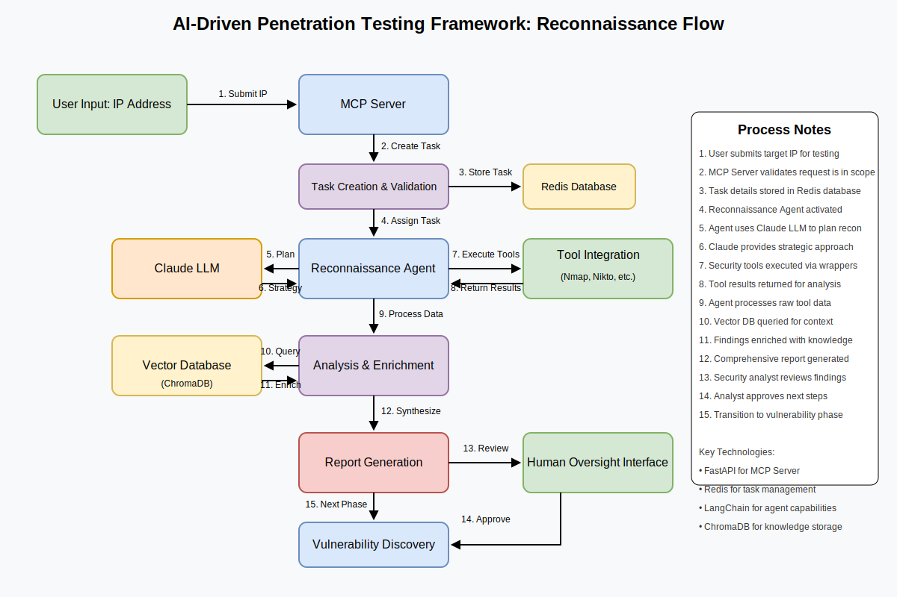

# AI-Driven Penetration Testing Framework

A multi-agent system using large language models to automate reconnaissance and vulnerability discovery phases of penetration testing.



## Key Features

- **Multi-Agent Architecture** - Specialized agents for reconnaissance and vulnerability discovery
- **Vector Database** - ChromaDB-powered knowledge base for semantic security pattern matching
- **Real-Time Monitoring** - WebSocket-based notification system for task status updates
- **Workflow Orchestration** - Automated chaining of penetration testing phases
- **LLM Integration** - Claude-powered analysis and reasoning for security findings
- **HTML Reporting** - Comprehensive security assessment reports with visualizations

## Tech Stack

- **FastAPI** - High-performance API framework for the MCP server
- **Redis** - Task queues and real-time communication
- **ChromaDB** - Vector database for security knowledge
- **Claude API** - Large language model for security analysis
- **Docker** - Containerized deployment for consistent environments
- **WebSockets** - Real-time status updates and notifications

## Quick Start

### Prerequisites

- Docker and Docker Compose
- Python 3.10+
- Anthropic API key (for Claude)

### Installation

```bash
# Clone the repository
git clone https://github.com/yourusername/ai-driven-pentesting.git
cd ai-driven-pentesting

# Create .env file with your API keys
cp .env.example .env
# Edit .env with your keys

# Build and start the containers
docker-compose up --build -d

# Start the required agents
python -m src.utils.agent_manager --all

# In another terminal, create a workflow
python -m src.utils.test_workflow --target 192.168.1.1
 ```

The scan results and report will be available at http://localhost:8000/api/workflows/{workflow_id}/report

## Security Notice
This tool is designed for legitimate security testing only. Always ensure proper authorization before conducting any security testing against systems or networks.

## Documentation
For complete documentation, see:
- [Project Overview](docs/overview.md)
- [Project Structure](docs/project_structure.md) 
- [Architecture](docs/architecture.md)
- [Agent System](docs/agents.md)
- [Knowledge Base](docs/knowledge_base.md)
- [MCP Server](docs/mcp_server.md)
- [API Reference](docs/api.md)
- [Usage Examples](docs/examples.md)

## License
MIT
